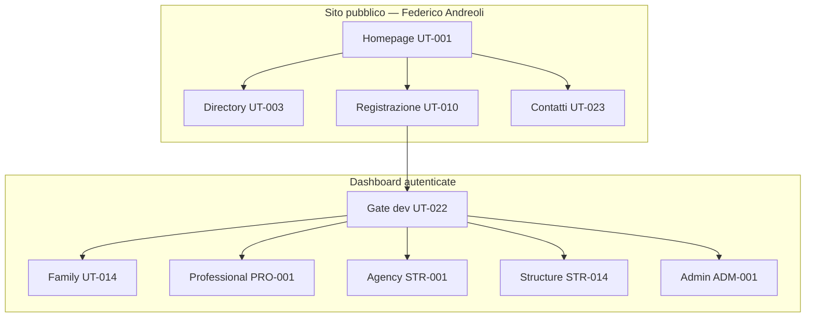

# Documentazione Frontend — Federico Andreoli

> Piattaforma socio-sanitaria per matching famiglie/assistiti, strutture (RSA, agenzie) e professionisti.
> Stack: **React 19 + Vite 8 + TypeScript**, React Router 7, design tokens CSS custom.
> Stato: **frontend mock-first COMPLETO** (SPRINT-01 … SPRINT-22, 2026-06-04). Prossima fase: backend Laravel.

---

## Sprint completati (22)

| Fase | Sprint | Focus |
|------|--------|-------|
| P0 Foundation | 01–02 | Auth mock, ProtectedRoute, RBAC |
| P0 Core | 03–05 | Registrazione, profilo PRO, richieste famiglia |
| P0 Trust | 06–07 | KYC admin, directory API mock |
| P0 Monetization | 08 | Stripe checkout mock |
| P0 Fix | 09–10 | Contatti, brand, split structure/agency |
| P1 | 11–15 | Annunci B2B, candidature, admin utenti, notifiche, cookie analytics |
| P2 | 16–22 | Password reset, export CSV, multi-sede, messaging, admin tickets/settings, moderazione B2B, team, Premium RSA |

Chiusura documentazione: **SPRINT-23** (sync doc + report completamento). Dettaglio: [08-PIANO-SVILUPPO-VERTICALE.md](08-PIANO-SVILUPPO-VERTICALE.md) · [10-FRONTEND-COMPLETAMENTO.md](10-FRONTEND-COMPLETAMENTO.md).

---

## Navigazione rapida

| # | Documento | Contenuto |
|---|-----------|-----------|
| 01 | [Visione prodotto](01-VISIONE-PRODOTTO.md) | Missione, 4 personas, user journey |
| 02 | [Architettura frontend](02-ARCHITETTURA-FRONTEND.md) | Stack, cartelle, routing, pattern |
| 03 | [Admin (ADM)](03-ADMIN/README.md) | ADM-001 → ADM-015 |
| 04 | [Struttura B2B (STR)](04-STRUTTURA-B2B/README.md) | STR-001 → STR-014, STR-P01/P02/P03 |
| 05 | [Utente finale (UT)](05-UTENTE-FINALE/README.md) | UT-001 → UT-024 |
| 06 | [Professionista (PRO)](06-PROFESSIONISTA/README.md) | PRO-001 → PRO-007, PRO-W01 → PRO-W20 |
| 06b | [Componenti condivisi](06-COMPONENTI-CONDIVISI.md) | Libreria UI pubblica e dashboard |
| 07 | [Gap analysis](07-STATO-ATTUALE-GAP-ANALYSIS.md) | Gap residui Fase 2 (Laravel, Stripe, email, …) |
| 08 | [Piano sviluppo verticale](08-PIANO-SVILUPPO-VERTICALE.md) | Sprint 01–23 completati + Fase 2 stub |
| 09 | [Design system & UX](09-DESIGN-SYSTEM-UX.md) | Token, pattern, breakpoint, a11y |
| 10 | [Frontend completamento](10-FRONTEND-COMPLETAMENTO.md) | Executive summary, demo accounts, handoff |

---

## Mappa moduli per persona

---

## Lavoro residuo (Fase 2)

| Area | Riferimento |
|------|-------------|
| Swap mock → API Laravel | [07-STATO-ATTUALE-GAP-ANALYSIS.md](07-STATO-ATTUALE-GAP-ANALYSIS.md), [10-FRONTEND-COMPLETAMENTO.md](10-FRONTEND-COMPLETAMENTO.md) |
| Stripe reale | PRO-007, SPRINT-08 |
| Email transazionale | Auth OTP, reset password, notifiche |
| WebSocket | Notifiche/messaging (oggi polling) |
| Test E2E | Non configurati |
| i18n | Backlog |

---

## Repository

| Path | Descrizione |
|------|-------------|
| `federicoandreoli-web/` | Frontend React (questa documentazione) |
| `federicoandreoli-api/` | Backend Laravel, ruoli auth, OTP, Stripe webhook |

---

## Convenzioni documento funzionalità

Ogni file `ADM-*`, `STR-*`, `UT-*`, `PRO-*` include:

ID · Titolo · Persona · User stories · Wireframe · Componenti · Stati · Validazioni · Mock JSON · Criteri accettazione · Dipendenze · Priorità · Stato · Route · File sorgente

---

_Ultimo aggiornamento: giugno 2026 — SPRINT-23 sync post SPRINT-22_
