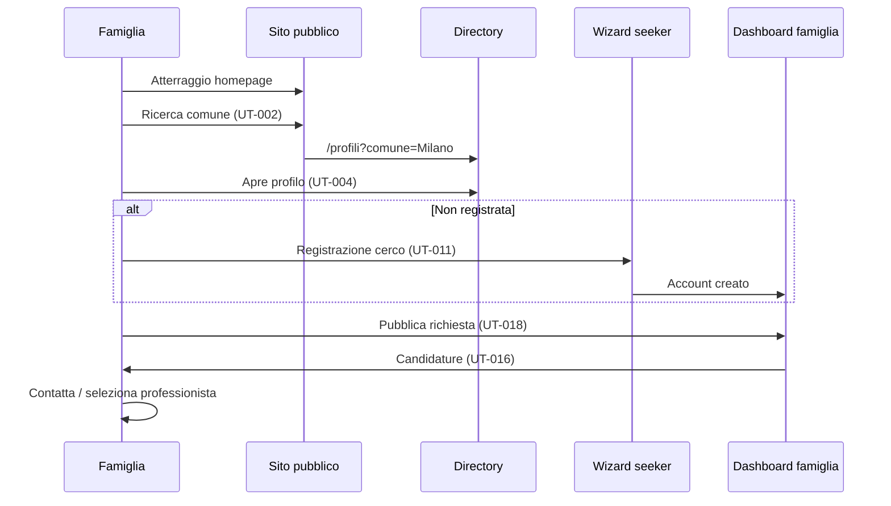
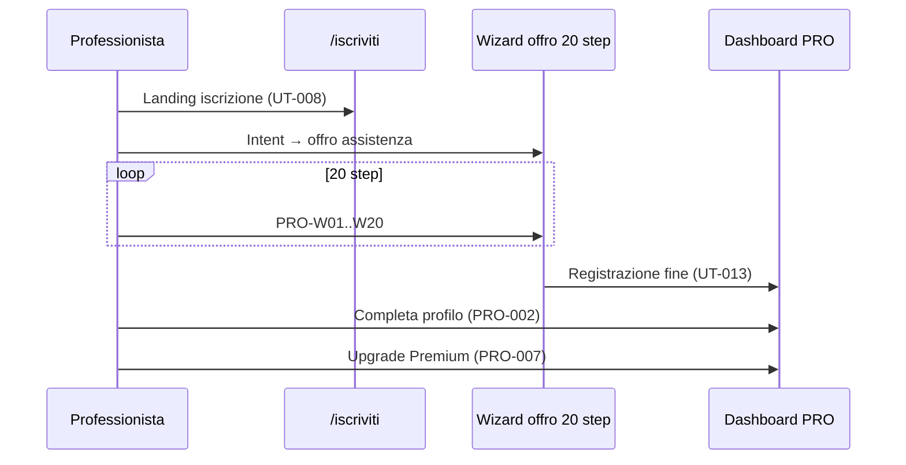
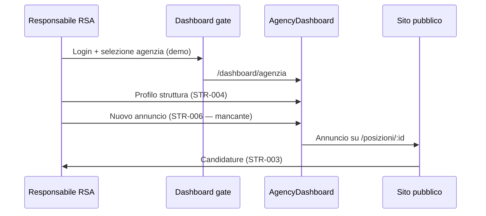
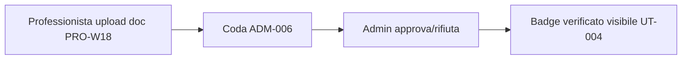

# 01 — Visione prodotto

## Missione

**Federico Andreoli** è una piattaforma digitale socio-sanitaria che connette:

- **Famiglie e assistiti** che cercano badanti, OSS, infermieri e assistenti familiari
- **Professionisti** del settore che offrono competenze e disponibilità
- **Strutture e agenzie** (RSA, case di cura, agenzie domiciliari) che reclutano personale
- **Amministratori** che garantiscono qualità, verifica documenti e monetizzazione

Il valore core è **fiducia + matching geografico**: profili verificati, ricerca per comune italiano, candidature bidirezionali (famiglia pubblica richiesta / professionista si candida ad annuncio).

---

## Ambiguità brand (blocker)

| Contesto | Brand usato | Dove |
|----------|-------------|------|
| Sito pubblico, header, footer, legal | **Federico Andreoli** | `SiteHeader`, `SiteFooter`, `HomePage` |
| Dashboard gate, sidebar dashboard | **AssistenzaFacile** | `DashboardGatePage`, `DashboardLayout` |

**Raccomandazione:** allineare a un unico brand consumer-facing (probabilmente Federico Andreoli) con sottobrand opzionale per area riservata, oppure rebrand completo dashboard. Decisione prodotto richiesta prima del go-live.

---

## Personas

### 1. Admin piattaforma (`platform_admin`)

Supervisiona utenti, richieste, abbonamenti, ticket supporto, coda verifica KYC e impostazioni globali.

- Modulo: [03-ADMIN/](03-ADMIN/README.md)
- Dashboard: `/dashboard/admin`

### 2. Struttura B2B (`agency` + `structure`)

**Agenzia domiciliare** o **RSA/struttura residenziale** che pubblica posizioni aperte, gestisce candidature e team interno.

- Modulo: [04-STRUTTURA-B2B/](04-STRUTTURA-B2B/README.md)
- Dashboard attuale: `/dashboard/agenzia` (entrambi i ruoli backend)
- Gap: backend distingue `agency` e `structure`; frontend no → [STR-014](04-STRUTTURA-B2B/STR-014.md)

### 3. Utente finale — famiglia (`public_user`)

Cerca assistenza, consulta profili, pubblica richieste, gestisce candidature e preferiti.

- Modulo: [05-UTENTE-FINALE/](05-UTENTE-FINALE/README.md)
- Dashboard: `/dashboard/famiglia`

### 4. Professionista — supply side (`professional`)

Crea profilo ricco, riceve contatti, invia candidature, gestisce piano FREE/Premium.

- Modulo: [06-PROFESSIONISTA/](06-PROFESSIONISTA/README.md)
- Wizard registrazione: 20 step `/registrazione/offro/*`
- Dashboard: `/dashboard/professionale`

---

## User journey principali

### Journey A — Famiglia cerca badante

### Journey B — Professionista si iscrive

### Journey C — RSA pubblica posizione

### Journey D — Admin verifica profilo

---

## Modello freemium

| Piano | Professionista | Famiglia (target) |
|-------|----------------|-------------------|
| FREE | 3 contatti/mese, 5 candidature, no badge | Limiti richieste (config ADM-010) |
| Premium €19,90/m | Illimitato, priorità ricerca, badge | TBD |

Configurazione prezzi admin: [ADM-007](03-ADMIN/ADM-007.md)

---

## Metriche di successo (north star)

1. **Match completati** — famiglia/struttura seleziona professionista
2. **Profili verificati** — % professionisti con KYC approvato
3. **MRR** — abbonamenti Premium professionisti (+ B2B futuro STR-P01)
4. **Time-to-first-candidatura** — ore dalla pubblicazione richiesta

---

## Riferimenti

- Architettura: [02-ARCHITETTURA-FRONTEND.md](02-ARCHITETTURA-FRONTEND.md)
- Gap e backlog: [07-STATO-ATTUALE-GAP-ANALYSIS.md](07-STATO-ATTUALE-GAP-ANALYSIS.md)
- Piano sprint: [08-PIANO-SVILUPPO-VERTICALE.md](08-PIANO-SVILUPPO-VERTICALE.md)
