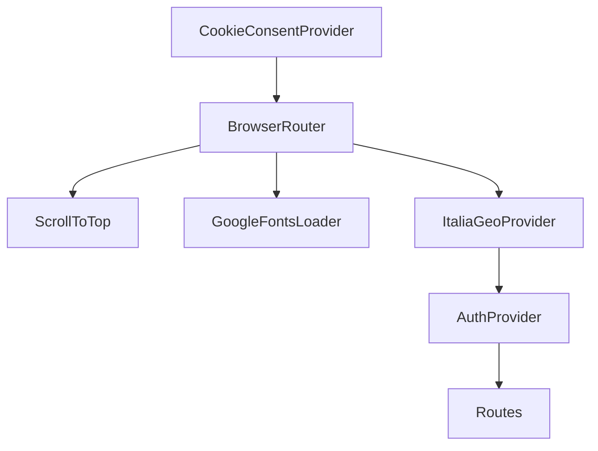

# 02 — Architettura frontend

## Stack tecnologico

| Layer | Tecnologia | Versione (package.json) |
|-------|------------|-------------------------|
| Runtime UI | React | ^19.2.5 |
| Bundler | Vite | ^8.0.10 |
| Linguaggio | TypeScript | ~6.0.2 |
| Routing | react-router-dom | ^7.14.2 |
| Ricerca fuzzy geo | fuse.js | ^7.3.0 |
| Styling | CSS custom + design tokens | `src/design-system/` |
| API client | fetch nativo | `src/lib/api.ts` (solo meta) |

**Non presenti:** Redux/Zustand, React Query, UI library (MUI/Chakra), CSS-in-JS, test runner configurato.

---

## Struttura cartelle

```
federicoandreoli-web/src/
├── App.tsx                 # Router root, provider stack
├── App.css                 # Stili dashboard + gate
├── index.css               # Import tokens, reset, utility globali
├── main.tsx                # Entry + StrictMode
│
├── auth/                   # Demo session (sessionStorage)
│   ├── AuthProvider.tsx
│   ├── authContext.ts
│   ├── demoAuthSession.ts
│   └── useAuth.ts
│
├── components/             # UI condivisa sito pubblico (20 file)
│   ├── SiteShell.tsx       # Layout pagine pubbliche
│   ├── SiteHeader.tsx
│   ├── SiteFooter.tsx
│   ├── ItaliaGeoSearchCombobox.tsx
│   └── … (home, cookie, auth dialog)
│
├── context/
│   ├── CookieConsentContext.tsx
│   └── ItaliaGeoProvider.tsx   # Carica italia-comuni.json
│
├── design-system/
│   ├── tokens.css          # CSS custom properties
│   └── tokens.ts           # Export TS (colori, spacing)
│
├── hooks/                  # Hook UI (sticky, typewriter, geo fuse)
│
├── lib/
│   ├── api.ts              # fetchApiMeta
│   ├── runtimeConfig.ts    # VITE_API_BASE_URL
│   ├── siteRoutes.ts       # Path constants
│   ├── mockProfiles.ts
│   ├── mockOpenPositions.ts
│   └── italiaGeo/          # Flatten comuni, regioni
│
├── mocks/                  # Dati demo directory/posizioni
│
├── pages/
│   ├── HomePage.tsx
│   ├── ProfilesDirectoryPage.tsx
│   ├── ProfileDetailPage.tsx
│   ├── OpenPositionDetailPage.tsx
│   ├── ComeFunzionaPage.tsx
│   ├── IscrizioneLandingPage.tsx
│   ├── auth/               # Login, wizard registrazione
│   ├── legal/              # Termini, privacy, cookie
│   └── dashboard/        # Gate + 4 dashboard monolitiche
│       ├── DashboardGatePage.tsx
│       ├── DashboardLayout.tsx
│       ├── admin/AdminDashboard.tsx
│       ├── agency/AgencyDashboard.tsx
│       ├── family/FamilyDashboard.tsx
│       └── professional/ProfessionalDashboard.tsx
│
└── assets/
```

---

## Mappa routing

Definita in `App.tsx`:

| Path | Componente | Persona |
|------|------------|---------|
| `/` | HomePage | Pubblico |
| `/come-funziona` | ComeFunzionaPage | Pubblico |
| `/profili` | ProfilesDirectoryPage | Pubblico |
| `/profili/:id` | ProfileDetailPage | Pubblico |
| `/iscriviti` | IscrizioneLandingPage | Professionista |
| `/posizioni/:id` | OpenPositionDetailPage | Pubblico/PRO |
| `/accedi` | LoginPage | Autenticato |
| `/termini` | TerminiPage | Pubblico |
| `/privacy` | PrivacyPolicyPage | Pubblico |
| `/cookie` | CookiePolicyPage | Pubblico |
| `/dashboard` | DashboardGatePage | Demo gate |
| `/dashboard/professionale` | ProfessionalDashboard | professional |
| `/dashboard/famiglia` | FamilyDashboard | public_user |
| `/dashboard/agenzia` | AgencyDashboard | agency **e** structure |
| `/dashboard/admin` | AdminDashboard | platform_admin |
| `/registrazione/intent` | RegisterIntentWizardPage | Nuovo utente |
| `/registrazione/offro/:stepId` | OfferWizardPage | PRO (20 step) |
| `/registrazione/cerco/:stepId` | SeekerWizardPage | Famiglia (9 step) |
| `/registrazione/fine` | RegisterFinePage | Post-wizard |
| `*` | Redirect → `/` | — |

**Route mancante:** `/contatti` (link in `DashboardLayout` linea ~186).

Costanti aggiuntive: `lib/siteRoutes.ts` (`comeFunzionaPath`, `profilesDirectoryPath`, `profileDetailPath`).

---

## Provider stack (outer → inner)



Registrazione wizard aggiunge `RegisterWizardProvider` solo sul subtree `/registrazione/*`.

---

## Pattern architetturali

### Dashboard monolitiche con sezioni

Ogni dashboard (`AdminDashboard`, `AgencyDashboard`, …) è un **single route** con navigazione interna via `useState(activeSection)`. Non ci sono sub-route React Router per sezioni.

```tsx
// Pattern comune
const [activeSection, setActiveSection] = useState('overview')
return (
  <DashboardLayout activeSection={activeSection} onSectionChange={setActiveSection} …>
    {renderSection()}
  </DashboardLayout>
)
```

**Pro:** prototipazione rapida, mock locale.  
**Contro:** no deep-link, no lazy load per sezione, difficile RBAC granulare.

### Mock data inline

I dati demo vivono come costanti `MOCK_*` nello stesso file della dashboard. Mutazioni (sospendi, archivia) aggiornano solo React state locale.

### Wizard registrazione

- Step IDs in `stepConfig.ts` (`OFFER_STEP_IDS`, `SEEKER_STEP_IDS`)
- Draft persistito in `localStorage` via `registerDraft.ts`
- Shell condivisa: `WizardShell.tsx`, context `RegisterWizardContext.tsx`

### Geo search

1. `ItaliaGeoProvider` carica `/data/italia-comuni.json`
2. `useItaliaGeoFuse` + Fuse.js per autocomplete
3. `ItaliaGeoSearchCombobox` componente riusabile

### Auth attuale (demo)

```ts
// demoAuthSession.ts — sessionStorage key 'fa-demo-session'
signInDemoSession() // LoginPage
signOutDemoSession()
```

Nessun JWT, nessun guard sulle route dashboard. Backend Laravel espone OTP email (`EmailOtpAuthController`) — integrazione frontend pending.

---

## Mapping ruoli backend → frontend

| Backend `UserRole` | Frontend route | Note |
|--------------------|----------------|------|
| `platform_admin` | `/dashboard/admin` | No guard |
| `professional` | `/dashboard/professionale` | — |
| `public_user` | `/dashboard/famiglia` | — |
| `agency` | `/dashboard/agenzia` | — |
| `structure` | `/dashboard/agenzia` | **Unificato — gap** |

Enum backend: `federicoandreoli-api/app/Domains/Auth/Enums/UserRole.php`

---

## Convenzioni codice

| Aspetto | Convenzione |
|---------|-------------|
| Componenti | PascalCase, export named |
| File pagina | `*Page.tsx` o `*Dashboard.tsx` |
| CSS | Co-located (`*.css`) + classi BEM-like `dash-*`, `legal-*`, `home-*` |
| Icone | Inline SVG function components (no icon library) |
| Import | Top of file (no inline imports) |
| Path alias | Nessuno configurato — import relativi `./` `../` |
| Env | `VITE_*` via `runtimeConfig.ts` |

---

## Build e deploy

```bash
npm run dev      # Vite dev server
npm run build    # tsc -b && vite build → dist/
npm run lint     # ESLint
```

Deploy: GitHub Actions in `.github/workflows/deploy.yml`, static hosting con `_redirects` SPA fallback.

---

## Integrazione API (stato)

| Endpoint | Uso frontend |
|----------|--------------|
| `GET /api/v1/meta` | `fetchApiMeta()` — smoke test |
| Auth OTP | Non integrato |
| Profili/richieste CRUD | Non integrato — mock |
| Stripe webhook | Solo backend |

Base URL: `VITE_API_BASE_URL` in `.env.example`

---

## Dipendenze tra moduli doc

- Componenti: [06-COMPONENTI-CONDIVISI.md](06-COMPONENTI-CONDIVISI.md)
- Design: [09-DESIGN-SYSTEM-UX.md](09-DESIGN-SYSTEM-UX.md)
- Sprint plan: [08-PIANO-SVILUPPO-VERTICALE.md](08-PIANO-SVILUPPO-VERTICALE.md)
