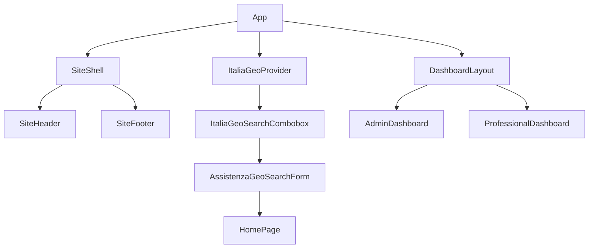

# 06 — Componenti condivisi

Libreria componenti in `federicoandreoli-web/src/components/` e pattern UI riusati nelle dashboard.

---

## Layout e shell

### `SiteShell.tsx`

Wrapper pagine pubbliche: header + main + footer.

| Prop | Uso |
|------|-----|
| `children` | Contenuto pagina |

**Usato da:** HomePage, ProfilesDirectoryPage, legal pages, ComeFunzionaPage, ecc.

### `SiteHeader.tsx`

Header sticky con logo Federico Andreoli, nav desktop/mobile, link Cerca/Offri assistenza, login, iscrizione.

| Comportamento | Dettaglio |
|---------------|-----------|
| Scroll | Classe `scrolled` dopo 16px |
| Mobile | Drawer full-screen, lock body scroll |
| Hero links | `assistenzaHeroCercoLink` / `assistenzaHeroOffroLink` — scroll top su `/` |

**File:** `federicoandreoli-web/src/components/SiteHeader.tsx`

### `SiteFooter.tsx`

Footer 4 colonne (chi cerca, chi offre, piattaforma, legal) + social + cookie settings trigger.

**Nota:** link "Centro assistenza" punta a `#` external — correlato a UT-023.

**File:** `federicoandreoli-web/src/components/SiteFooter.tsx`

### `AuthShell.tsx`

Layout centrato per pagine auth (login, wizard).

**File:** `federicoandreoli-web/src/components/AuthShell.tsx`

### `DashboardLayout.tsx`

Shell dashboard con sidebar desktop, tab bar mobile (max 5 tab), topbar, support link.

| Prop | Tipo | Descrizione |
|------|------|-------------|
| `accountType` | `'professional' \| 'family' \| 'agency' \| 'admin'` | Badge ruolo |
| `navItems` | `NavItem[]` | Sezioni interne |
| `activeSection` | `string` | Sezione corrente |
| `profileCompletion` | `number?` | Solo professional |
| `planType` | `'free' \| 'premium'?` | Badge piano |

**Brand sidebar:** AssistenzaFacile  
**Bug:** `navigate('/contatti')` — route inesistente

**File:** `federicoandreoli-web/src/pages/dashboard/DashboardLayout.tsx`

---

## Geo e ricerca

### `ItaliaGeoSearchCombobox.tsx`

Autocomplete comune italiano con Fuse.js, keyboard nav, aria combobox.

| Stato | UI |
|-------|-----|
| loading | Provider carica JSON |
| empty | "Nessun comune trovato" |
| selected | Valore + regione/provincia |

**Dipendenze:** `ItaliaGeoProvider`, `useItaliaGeoFuse`

### `AssistenzaGeoSearchForm.tsx`

Form hero dual-mode cerca/offri con geo + submit navigazione.

### `HomeCitiesGeoSearchBar.tsx` / `HomeStickySearch.tsx`

Varianti ricerca homepage con sticky behavior.

### `ProfilesDirectoryStickyGeoSearch.tsx`

Barra filtro geo sticky nella directory profili.

### `HeroCitySearchRow.tsx` / `HeroAssistenzaBlock.tsx`

Composizione hero homepage.

**Hooks correlati:** `useHeroSearchParams`, `useHeroStickySearchVisible`, `useProfilesDirectoryStickyHeroCity`

---

## Homepage

| Componente | Ruolo |
|------------|-------|
| `HomeProfileCarousel.tsx` | Carousel profili demo |
| `HomeOpenPositionsSection.tsx` | Card posizioni aperte |
| `HomeFaqIntroStats.tsx` | FAQ + statistiche intro |
| `HomeWaveDivider.tsx` | Separatore visivo SVG |

---

## Profili e rating

### `ProfileRatingCompact.tsx`

Stelle compatte per card profilo (usato in directory e dashboard family).

---

## Auth e conversione

### `CandidacyAuthDialog.tsx`

Dialog modale: candidatura a posizione richiede login/registrazione.

| Stato | Comportamento |
|-------|---------------|
| anonimo | Mostra CTA accedi/registrati |
| autenticato | Submit candidatura (mock) |

---

## Cookie GDPR

### `CookieConsentBanner.tsx`

Banner first-party consenso con accetta/rifiuta/personalizza.

### `CookieSettingsTrigger.tsx`

FAB/pulsante riapertura pannello preferenze.

**Context:** `CookieConsentContext` — categorie `necessary`, `functional`, `analytics`  
**Effetto:** Google Fonts caricati solo se `functional` consent (`App.tsx` GoogleFontsLoader)

**CSS:** `cookie-consent.css`

---

## Utility

### `ScrollToTop.tsx`

Scroll window top on route change.

---

## Pattern UI dashboard (classi CSS in App.css)

Non componenti React separati — **design system procedurale**:

| Classe | Uso |
|--------|-----|
| `dash-btn`, `dash-btn--primary/ghost/danger/sage/accent` | Pulsanti |
| `dash-card` | Container sezione |
| `dash-table`, `dash-table-wrap` | Tabelle responsive |
| `dash-badge`, `dash-badge--*` | Status chip |
| `dash-form-input`, `dash-form-select`, `dash-form-textarea` | Form fields |
| `dash-stat-grid`, `dash-stat-card` | KPI cards |
| `dash-candidate-row` | Riga candidato |
| `dash-modal-overlay`, `dash-modal` | Modali |
| `dash-toast` | Feedback save |
| `dash-empty-state` | Empty state illustrato |
| `dash-toggle`, `dash-day-pill`, `dash-chip` | Input avanzati PRO profile |
| `dash-gate`, `dash-gate-card` | Dashboard gate |

---

## Wizard components

| File | Ruolo |
|------|-------|
| `pages/auth/wizard/WizardShell.tsx` | Progress bar, nav avanti/indietro |
| `pages/auth/wizard/steps/ConsentStep.tsx` | Step consensi riusabile |
| `pages/auth/RegisterWizardContext.tsx` | State wizard condiviso |

---

## Albero dipendenze (semplificato)

---

## Checklist riuso nuovo componente

1. Preferire token CSS (`var(--color-primary)`) non hex hardcoded
2. Supportare `prefers-reduced-motion` dove c'è animazione (vedi hook `usePrefersReducedMotion`)
3. Label associati a input (`dash-form-label`)
4. Icone SVG con `aria-hidden` se decorative

---

## Riferimenti

- Token: [09-DESIGN-SYSTEM-UX.md](09-DESIGN-SYSTEM-UX.md)
- Architettura: [02-ARCHITETTURA-FRONTEND.md](02-ARCHITETTURA-FRONTEND.md)
