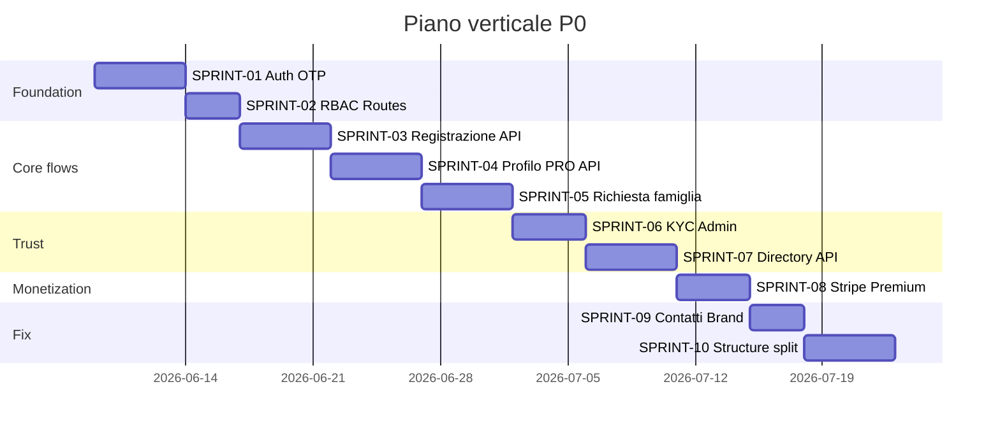

# 08 — Piano sviluppo verticale

> **SPRINT-01 (Auth foundation):** ✅ Completato 2026-06-04 — mock `authService` + `AuthProvider` + `ProtectedRoute` + login OTP/password; backend Laravel da collegare in SPRINT-01 follow-up o swap `authApi`.
> **SPRINT-02 (RBAC routes):** ✅ Completato 2026-06-04 — `ProtectedRoute` + `GuestOnlyRoute`, RBAC per dashboard, redirect post-login, gate `/dashboard` solo dev, `getPolicies` su login step 1.
> **SPRINT-03 (Registrazione API):** ✅ Completato 2026-06-04 — mock `registrationService` + `registrationApi`, submit wizard seeker/offer, `RegisterFinePage` con stato reale, upload documenti stub (`VITE_REGISTRATION_DOCUMENT_UPLOAD`).
> **SPRINT-04 (Profilo PRO API):** ✅ Completato 2026-06-04 — mock `professionalProfileService` + `professionalProfileApi`, hook `useProfessionalProfile`, dashboard PRO-002 wired con PATCH, completion % server-side, sync `/profili/prof-1`.
> **SPRINT-05 (Richiesta famiglia):** ✅ Completato 2026-06-04 — mock `familyRequestService` + `familyRequestApi`, hook `useFamilyRequests`, form UT-018 → POST mock, lista UT-015 e candidature UT-016 da store, limite FREE 1 richiesta attiva.
> **SPRINT-06 (KYC Admin):** ✅ Completato 2026-06-04 — mock `adminKycService` + `adminKycApi`, hook `useAdminKycQueue`, SectionVerify con approve/reject persistenti, viewer documenti (immagine/PDF mock), `isProfessionalKycVerified` per SPRINT-07.
> **SPRINT-07 (Directory API):** ✅ Completato 2026-06-04 — mock `directoryService` + `directoryApi`, hook `useDirectorySearch` / `useDirectoryProfile` / `useDirectoryStructure`, pagine `/profili` e `/strutture/:id` wired, badge KYC UT-004, STR-P02 scheda struttura/agenzia, posizioni aperte UT-005 via servizio.
> **SPRINT-08 (Stripe Premium):** ✅ Completato 2026-06-04 — mock `billingService` + `billingApi`, hook `useBillingSubscription` / `useAdminBilling`, PRO-007 UpgradeModal + checkout mock/redirect, Agency B2B abbonamento, Admin abbonamenti read-only, `VITE_STRIPE_ENABLED` (default false).
> **SPRINT-09 (Contatti Brand):** ✅ Completato 2026-06-04 — `ContattiPage` + route `/contatti`, mock `contactApi`, `brand.ts` unifica "Federico Andreoli" su sito e dashboard, footer/dashboard Supporto linkati.
> **SPRINT-10 (Structure split):** ✅ Completato 2026-06-04 — `StructureDashboard` su `/dashboard/struttura`, RBAC agency/structure separati, STR-014 chiuso. **Piano P0 verticale: completo.**
> **SPRINT-11 (Annuncio B2B wizard):** ✅ Completato 2026-06-04 — mock `jobPostingService` + wizard 7 step, `useJobPostings`, `AgencyDashboard` / `StructureDashboard` «I miei annunci», annunci `active` in directory UT-005.
> **SPRINT-12 (Candidature bidirezionali):** ✅ Completato 2026-06-04 — mock `applicationService` + `applicationApi`, hook `useApplications`, PRO candidature/posizioni, B2B candidature per annuncio (STR-003), famiglia UT-016 via store unificato, `applicationCount` su job postings.
> **SPRINT-13 (Admin utenti API):** ✅ Completato 2026-06-04 — mock `adminUserService` + `adminUserApi`, hook `useAdminUsers`, SectionUsers con filtri/search, sospendi/riattiva persistenti, modal dettaglio ADM-011 (storico attività + documenti KYC collegati), stati loading/empty/error.
> **SPRINT-14 (Notifiche polling):** ✅ Completato 2026-06-04 — mock `notificationService` + `notificationApi`, hook `useNotifications` (polling 30s), `DashboardNotificationsSection`, PRO/STR/agency/family dashboard, badge sidebar.

> **SPRINT-15 (Cookie analytics opt-in):** ✅ Completato 2026-06-04 — `lib/analytics.ts` gated by consent, `VITE_ANALYTICS_ID` (dev stub console), CookieConsentContext init/revoke, Cookie Policy aggiornata. **Piano P1 verticale: completo.**
> **SPRINT-16 (Password reset + Account settings):** ✅ Completato 2026-06-04 — mock `passwordResetService` + `accountSettingsService`, `/password-dimenticata` + `/reimposta-password`, `AccountSettingsSection` su tutte le dashboard, link da LoginPage.
> **SPRINT-17 (Export CSV + Admin analytics):** ✅ Completato 2026-06-04 — `lib/exportUtils.ts` client-side CSV/JSON download, B2B annunci/candidature (STR-P03), Admin overview KPI export (ADM-013).
> **SPRINT-18 (Multi-sede / filiali B2B):** ✅ Completato 2026-06-04 — `locationService` + `useOrganizationLocations`, sezione Sedi operative su dashboard agenzia/struttura, sync pubblico `/strutture/:id`, wizard annunci sede da sedi org.
> **SPRINT-19 (Messaging / inbox):** ✅ Completato 2026-06-04 — mock `messagingService` + `messagingApi`, hook `useMessaging`, `DashboardMessagingSection`, dashboard famiglia/PRO Messaggi, `ContactAuthDialog` + contatto da `ProfileDetailPage`, thread legati a candidatura/contatto diretto, badge unread in nav.
> **SPRINT-20 (Messaging B2B):** ✅ Completato 2026-06-04 — inbox Messaggi su dashboard agenzia/struttura, seed thread B2B, «Contatta candidato» → thread + sync `applicationService`, badge unread nav B2B.
> **SPRINT-21 (Admin dispute + settings):** ✅ Completato 2026-06-04 — mock `adminTicketService` + `adminSettingsService`, hook `useAdminTickets` / `useAdminSettings`, SectionTickets (prendi in carico, chiudi, thread modal) e SectionSettings persistiti in localStorage, toast su salvataggio.
> **SPRINT-22 (Moderazione B2B + team + Premium RSA):** ✅ Completato 2026-06-04 — mock `adminJobModerationService` + `teamMemberService`, annunci `pending_review` con approve/reject admin, `TeamMembersSection` agenzia/struttura, billing `structure_premium_monthly` distinto da agency Business.
> **SPRINT-23 (Documentazione sync + report completamento):** ✅ Completato 2026-06-04 — sync stati feature doc post SPRINT-22, riscrittura gap analysis (frontend mock-first COMPLETO), indice generale, [10-FRONTEND-COMPLETAMENTO.md](10-FRONTEND-COMPLETAMENTO.md), stub Fase 2 Backend Laravel. **Nessuna modifica codice applicativo.**

Piano ordinato per **slice verticali** completabili end-to-end (UI + API + accettazione). Ogni sprint include ID, scope, mock data, criteri accettazione e istruzioni per agent Cursor.

---

## Sequenza sprint (overview)



---

## Top 10 P0 — Specifiche sprint

---

### SPRINT-01 — Auth OTP email

**Scope:** Sostituire demo auth con login OTP backend Laravel.

**Feature collegate:** UT-009, ADM-015, UT-022

**File da modificare:**
- `federicoandreoli-web/src/pages/auth/LoginPage.tsx`
- `federicoandreoli-web/src/auth/AuthProvider.tsx`
- `federicoandreoli-web/src/auth/demoAuthSession.ts` → deprecare o fallback dev
- `federicoandreoli-web/src/lib/api.ts` — aggiungere client auth

**Mock data (dev fino a API):**
```json
{
  "email": "maria.rossi@email.it",
  "otp": "123456",
  "user": {
    "id": "uuid",
    "role": "professional",
    "name": "Maria Rossi"
  }
}
```

**Criteri di accettazione:**
- [x] Utente inserisce email → riceve OTP (o stub dev)
- [x] OTP valido crea sessione con ruolo da backend (mock fixtures)
- [x] Sessione persiste refresh pagina (sessionStorage mock; Sanctum cookie in follow-up)
- [x] Logout pulisce sessione
- [x] Errori: OTP scaduto, email non registrata

**Istruzioni agent:**
1. Leggere `federicoandreoli-api/docs/AUTH.md` e `EmailOtpAuthController`
2. Implementare `authApi.ts` con `requestOtp`, `verifyOtp`, `logout`, `getMe`
3. Estendere `AuthProvider` con user object `{ id, role, name, email }`
4. Rimuovere navigazione libera post-login verso gate — redirect by role
5. Non committare `.env` con secrets

---

### SPRINT-02 — Protected routes e RBAC

**Scope:** Guard React Router per dashboard e redirect automatico.

**Feature:** UT-022, ADM-015

**File:**
- Nuovo `src/auth/ProtectedRoute.tsx`
- `App.tsx` — wrappare route `/dashboard/*`

**Mapping redirect post-login:**

| Ruolo | Path |
|-------|------|
| `platform_admin` | `/dashboard/admin` |
| `professional` | `/dashboard/professionale` |
| `public_user` | `/dashboard/famiglia` |
| `agency` | `/dashboard/agenzia` |
| `structure` | `/dashboard/struttura` (placeholder sprint 10) |

**Criteri di accettazione:**
- [x] Anonimo su `/dashboard/professionale` → redirect `/accedi`
- [x] Professional non accede `/dashboard/admin` → redirect al proprio dashboard
- [x] Gate `/dashboard` visibile solo dev (`import.meta.env.DEV`)
- [x] Utente autenticato su `/accedi` o `/registrazione/*` → redirect dashboard per ruolo
- [x] Login step 1: hint canale auth da `getPolicies()` + lookup email mock
- [x] Sidebar dashboard: brand link → home ruolo (non `/dashboard` in produzione)

**Istruzioni agent:**
1. Creare `ProtectedRoute` con prop `allowedRoles: UserRole[]`
2. Usare enum allineato a backend PHP
3. Mantenere gate demo dietro `import.meta.env.DEV` opzionale

---

### SPRINT-03 — Submit registrazione wizard → API

**Scope:** Persistenza registrazione seeker (9 step) e offer (20 step).

**Feature:** UT-011, UT-012, PRO-W20

**File:**
- `registerDraft.ts` — già serializza draft
- `OfferWizardPage.tsx`, `SeekerWizardPage.tsx` — step invio
- `RegisterFinePage.tsx`

**Mock payload offer (POST `/api/v1/registrations/professional`):**
```json
{
  "role": "badante",
  "experienceYears": "6-9",
  "firstName": "Maria",
  "lastName": "Rossi",
  "birthYear": 1982,
  "languages": ["Italiano", "Rumeno"],
  "availability": { "types": ["A ore"], "days": ["Lun","Mar"] },
  "address": { "comune": "Milano", "cap": "20100" },
  "consents": { "privacy": true, "marketing": false }
}
```

**Criteri di accettazione:**
- [x] Step invio chiama API e riceve 201
- [x] Draft localStorage cleared on success
- [x] Errori validation mostrati per campo
- [x] RegisterFinePage mostra stato reale (email verifica se richiesto)

**Istruzioni agent:**
1. Mappare ogni `OFFER_STEP_IDS` a campo API — tabella in PR description
2. Upload documenti step 18: multipart separato o presigned URL
3. Non bloccare su upload se API non pronta — flag feature

---

### SPRINT-04 — Profilo professionista CRUD

**Scope:** Dashboard PRO-002 backed by API.

**Feature:** PRO-002, PRO-001 (completion %)

**File:**
- `ProfessionalDashboard.tsx` SectionProfile
- Nuovo `lib/professionalProfileApi.ts`

**Mock response GET profile:**
```json
{
  "id": "prof-1",
  "completionPercent": 65,
  "identity": { "firstName": "Maria", "bio": "..." },
  "professional": { "category": "Badante", "specializations": [] },
  "availability": { "employmentTypes": ["A ore"], "days": ["Lun"] },
  "rates": { "hourly": 12, "monthlyLiveIn": 1200 },
  "zones": ["Milano Nord"],
  "certifications": ["OSS certificato"]
}
```

**Criteri di accettazione:**
- [x] Load profilo on mount dashboard
- [x] Salva modifiche → PATCH API + toast success
- [x] Completion % calcolato server-side
- [x] Loading skeleton durante fetch
- [x] Error state con retry

**Istruzioni agent:**
1. Estrarre form state in hook `useProfessionalProfile`
2. Sostituire `defaultValue` con controlled inputs
3. Calcolare checklist home (PRO-001) da API `missingFields[]`

---

### SPRINT-05 — Pubblica richiesta famiglia

**Scope:** UT-018 form → API → lista UT-015.

**File:**
- `FamilyDashboard.tsx` SectionNewRequest, SectionMyRequests

**Mock POST `/api/v1/requests`:**
```json
{
  "assistanceType": "badante",
  "beneficiary": "non_autosufficient_elderly",
  "employmentType": "live_in",
  "comune": "Milano",
  "budgetMonthly": 1200,
  "days": ["Lun","Mar","Mer"],
  "notes": "Nonna 87 anni..."
}
```

**Criteri di accettazione:**
- [x] Validazione client: comune obbligatorio, almeno 1 giorno
- [x] Submit crea richiesta status `active`
- [x] Lista richieste refresh senza reload
- [x] Limite piano FREE enforced (messaggio upgrade)

**Istruzioni agent:**
1. Riutilizzare `ItaliaGeoSearchCombobox` per campo comune
2. Wire pulsante "Pubblica richiesta" e "Salva bozza" (draft API opzionale P1)

---

### SPRINT-06 — KYC Admin queue

**Scope:** ADM-006 con API reale approve/reject.

**File:**
- `AdminDashboard.tsx` SectionVerify

**Mock pending item:**
```json
{
  "id": "ver-1",
  "professionalId": "prof-8",
  "name": "Luciana Toma",
  "category": "Infermiere",
  "documents": [
    { "type": "id_card", "url": "/storage/...", "status": "pending" }
  ],
  "submittedAt": "2026-05-08T10:00:00Z"
}
```

**Criteri di accettazione:**
- [x] Lista pending da mock service (paginazione API in follow-up)
- [x] Approva → `isProfessionalKycVerified(professionalId)` in localStorage per UT-004/SPRINT-07
- [x] Rifiuta con motivo → persist history + toast (notifica PRO con backend)
- [x] Empty state quando coda vuota
- [x] Viewer documenti modal (immagine + placeholder PDF)
- [x] Loading / error / retry

**Istruzioni agent:**
1. Modal "Vedi documenti" con viewer PDF/immagine
2. Audit log entry lato backend — frontend mostra toast only

---

### SPRINT-07 — Directory profili API

**Scope:** UT-003, UT-004 con dati reali + geo filter.

**File:**
- `ProfilesDirectoryPage.tsx`
- `ProfileDetailPage.tsx`
- Rimuovere dipendenza esclusiva da `mocks/profileDirectory.ts`

**Mock GET `/api/v1/profiles?comune=Milano`:**
```json
{
  "data": [
    {
      "id": "prof-1",
      "displayName": "Maria R.",
      "category": "Badante",
      "comune": "Milano",
      "rating": 4.8,
      "verified": true,
      "hourlyRate": 12
    }
  ],
  "meta": { "total": 42, "page": 1 }
}
```

**Criteri di accettazione:**
- [x] Ricerca geo query param `?istat=` / `?q=` (comune via Italia geo)
- [x] Paginazione («Mostra altri risultati»)
- [x] Dettaglio profilo da servizio directory (mock-first)
- [x] Fallback empty state zona senza profili
- [x] Scheda struttura/agenzia `/strutture/:id` (STR-P02)
- [x] Badge verificato KYC su card e dettaglio professionista

**Istruzioni agent:**
1. Mantenere mock come fallback `VITE_USE_MOCKS=true` (default in `runtimeConfig`)
2. SEO: meta title dinamico su ProfileDetailPage e StructureDetailPage

---

### SPRINT-08 — Stripe Premium checkout

**Scope:** PRO-007 modal → Stripe Checkout Session backend.

**File:**
- `ProfessionalDashboard.tsx` UpgradeModal
- `lib/billingApi.ts`, `lib/billingTypes.ts`, `services/billingService.ts`
- `hooks/useBillingSubscription.ts`, `hooks/useAdminBilling.ts`
- `pages/dashboard/billing/BillingMockCheckoutPage.tsx`, `BillingCheckoutReturnPage.tsx`
- `AgencyDashboard.tsx` sezione Abbonamento B2B
- `AdminDashboard.tsx` SectionSubscriptions

**Mock:** checkout embedded (PRO) o redirect pagina mock; card test `4242 4242 4242 4242` in dev. Flag `VITE_STRIPE_ENABLED=false` (default).

**Criteri di accettazione:**
- [x] CTA Premium crea checkout session
- [x] Redirect success/cancel URLs (`/dashboard/*/piano/esito`, mock checkout)
- [x] Completamento mock aggiorna piano → badge Premium in sidebar
- [x] Messaggio demo solo in dev (`showBillingDemoCopy()`); assente in production build

**Istruzioni agent:**
1. Leggere `StripeWebhookController.php`
2. Preferire redirect Checkout vs Elements per MVP
3. Swap `billingApi` → Laravel `POST /api/v1/billing/checkout-sessions` quando pronto

---

### SPRINT-09 — Contatti + brand alignment

**Scope:** UT-023 pagina contatti + unify brand strings.

**File:**
- Nuovo `pages/ContattiPage.tsx`
- `App.tsx` route `/contatti`
- `DashboardLayout.tsx`, `DashboardGatePage.tsx` — brand
- Costante `src/lib/brand.ts` centralizzata

**Mock:** form contatto POST `/api/v1/contact`

**Criteri di accettazione:**
- [x] `/contatti` 200 con form nome/email/messaggio
- [x] Link Supporto dashboard funziona
- [x] Brand unificato "Federico Andreoli" (o decisione documentata)
- [x] `<title>` coerenti

**Istruzioni agent:**
1. Chiedere conferma brand prima di mass replace
2. Footer "Centro assistenza" → `/contatti`
3. Stile pagina: `SiteShell` + form tokens

---

### SPRINT-10 — Split dashboard Structure

**Scope:** STR-014 — route e UI dedicata RSA.

**File:**
- Nuovo `pages/dashboard/structure/StructureDashboard.tsx`
- `App.tsx` `/dashboard/struttura`
- Fork da AgencyDashboard con copy/KPI RSA-specifici

**Differenze RSA vs Agenzia:**

| Aspetto | Agenzia | Struttura RSA |
|---------|---------|---------------|
| Terminology | "Network professionisti" | "Staff / reparti" |
| Annunci | Domiciliare | Turni reparto, OSS, infermieri |
| Team | Associati esterni | Dipendenti |

**Criteri di accettazione:**
- [x] Login structure → `/dashboard/struttura`
- [x] Login agency → `/dashboard/agenzia`
- [x] RBAC sprint 02 rispettato
- [x] Documentazione STR-014 aggiornata

**Istruzioni agent:**
1. Estrarre shared components da AgencyDashboard (DRY minimo: `B2BPostingTable`)
2. Non duplicare 1000 LOC — composizione

---

### SPRINT-11 — Annuncio B2B wizard (STR-006, STR-007)

**Scope:** Wizard creazione/modifica annuncio per agenzia e struttura RSA; persistenza mock; sync directory posizioni aperte.

**File:**
- `federicoandreoli-web/src/lib/jobPostingTypes.ts`
- `federicoandreoli-web/src/services/jobPostingService.ts`
- `federicoandreoli-web/src/lib/jobPostingApi.ts`
- `federicoandreoli-web/src/hooks/useJobPostings.ts`
- `federicoandreoli-web/src/pages/dashboard/b2b/JobPostingWizard.tsx`
- `federicoandreoli-web/src/pages/dashboard/b2b/B2BPostingsSection.tsx`
- `AgencyDashboard.tsx`, `StructureDashboard.tsx` — sezione annunci
- `directoryService.ts` — merge annunci pubblicati in UT-005

**Passi wizard:** ruolo → descrizione → requisiti → disponibilità → retribuzione → sede → pubblicazione

**Criteri di accettazione:**
- [x] «Nuovo annuncio» / «Nuovo turno» apre wizard modale
- [x] Modifica annuncio esistente con storico versioni (STR-007)
- [x] Lista da mock service (localStorage), non dati inline
- [x] Stati loading / empty / error / success
- [x] Annunci `active` visibili in home directory e `/posizioni/:id`
- [x] `npm run build` passa

**Istruzioni agent:** pattern `familyRequestService`; non duplicare wizard tra agenzia e struttura — usare `B2BPostingsSection` + `variant`.

---

### SPRINT-12 — Candidature bidirezionali (PRO-004, STR-003, UT-016)

**Scope:** Servizio mock unificato per candidature professionista → annuncio B2B o richiesta famiglia; gestione stati lato datore.

**File:**
- `federicoandreoli-web/src/lib/applicationTypes.ts`
- `federicoandreoli-web/src/services/applicationService.ts`
- `federicoandreoli-web/src/lib/applicationApi.ts`
- `federicoandreoli-web/src/hooks/useApplications.ts`
- `federicoandreoli-web/src/pages/dashboard/b2b/B2BCandidatesSection.tsx`
- `federicoandreoli-web/src/pages/dashboard/professional/ProfessionalApplicationsSections.tsx`
- `OpenPositionDetailPage.tsx`, `B2BPostingsSection.tsx`, dashboard PRO/B2B/famiglia

**Criteri di accettazione:**
- [x] Professionista candida da `/posizioni/:id`, dashboard «Posizioni» e «Le mie candidature»
- [x] B2B visualizza/gestisce candidature per annuncio (tab Candidati + pannello da tabella annunci)
- [x] Famiglia UT-016 da `applicationService` (non seed inline in `familyRequestService`)
- [x] Transizioni stato validate; `applicationCount` aggiornato su job postings
- [x] Stati loading / empty / error
- [x] `npm run build` passa

---

### SPRINT-13 — Admin utenti API (ADM-002, ADM-011, ADM-012)

**Scope:** Servizio mock utenti admin con persistenza localStorage; lista, filtri, sospendi/riattiva, dettaglio profilo con storico e documenti KYC.

**File:**
- `federicoandreoli-web/src/lib/adminUserTypes.ts`
- `federicoandreoli-web/src/services/adminUserService.ts`
- `federicoandreoli-web/src/lib/adminUserApi.ts`
- `federicoandreoli-web/src/hooks/useAdminUsers.ts`
- `federicoandreoli-web/src/pages/dashboard/admin/AdminDashboard.tsx` (SectionUsers, UserDetailModal)

**Criteri di accettazione:**
- [x] Tabella utenti da mock service (non seed inline)
- [x] Filtri ruolo, status e ricerca nome/email
- [x] Sospendi/riattiva persistenti in localStorage
- [x] «Vedi profilo» → modal dettaglio (ADM-011): summary, storico attività mock, documenti KYC collegati
- [x] Stati loading / empty / error
- [x] `npm run build` passa

---

### SPRINT-14 — Notifiche polling (PRO-006, STR-013)

**Scope:** Servizio mock notifiche con persistenza localStorage; hook con fetch, segna lette, conteggio non lette e polling ogni 30s; sezione condivisa su dashboard professionista, struttura, agenzia e famiglia.

**File:**
- `federicoandreoli-web/src/lib/notificationTypes.ts`
- `federicoandreoli-web/src/services/notificationService.ts`
- `federicoandreoli-web/src/lib/notificationApi.ts`
- `federicoandreoli-web/src/hooks/useNotifications.ts`
- `federicoandreoli-web/src/pages/dashboard/DashboardNotificationsSection.tsx`
- `federicoandreoli-web/src/pages/dashboard/professional/ProfessionalDashboard.tsx`
- `federicoandreoli-web/src/pages/dashboard/structure/StructureDashboard.tsx`
- `federicoandreoli-web/src/pages/dashboard/agency/AgencyDashboard.tsx`
- `federicoandreoli-web/src/pages/dashboard/family/FamilyDashboard.tsx`

**Criteri di accettazione:**
- [x] Lista notifiche da mock service (non seed inline dashboard)
- [x] Segna tutte lette + segna singola al click
- [x] Polling `setInterval` 30s con cleanup in hook
- [x] Badge non lette su voce sidebar «Notifiche»
- [x] Stati loading / empty / error
- [x] `npm run build` passa

---

## Sprint P1 (backlog breve)

| ID | Nome | Feature |
|----|------|---------|
| SPRINT-11 | Annuncio B2B wizard | STR-006, STR-007 ✅ |
| SPRINT-12 | Candidature bidirezionali API | PRO-004, STR-003, UT-016 ✅ |
| SPRINT-13 | Admin utenti API | ADM-002, ADM-011, ADM-012 ✅ |
| SPRINT-14 | Notifiche polling | PRO-006, STR-013 ✅ |
| SPRINT-15 | Cookie analytics opt-in | UT-020 ✅ |

**Piano P1 verticale: completo** (SPRINT-11 … SPRINT-15, 2026-06-04).

---

### SPRINT-15 — Cookie analytics opt-in (UT-020)

**Scope:** Gating analytics su consenso GDPR; nessun tracciamento prima del consenso.

**File:**
- `federicoandreoli-web/src/lib/analytics.ts`
- `federicoandreoli-web/src/context/CookieConsentContext.tsx`
- `federicoandreoli-web/src/components/CookieConsentBanner.tsx`
- `federicoandreoli-web/src/pages/legal/CookiePolicyPage.tsx`

**Env:** `VITE_ANALYTICS_ID` (vuoto in repo; dev = stub console quando impostato)

**Criteri di accettazione:**
- [x] Analytics init solo se `consent.analytics === true`
- [x] Revoke su «Solo necessari» / toggle analitici off
- [x] Pannello granulare necessari / funzionali / analitici / marketing
- [x] Consenso persistito localStorage (`cookie_consent_v1`)
- [x] Cookie Policy aggiornata (sezione analytics + tabella)
- [x] `npm run build` passa

---

## Template istruzioni agent (generico)

```markdown
## Task
[Sprint ID] — [Titolo]

## Context
- Doc: docs/frontend/[feature].md
- Backend: federicoandreoli-api/routes/api.php

## Constraints
- Minimize scope — no unrelated refactors
- Match existing CSS classes dash-* / tokens
- Imports at top of file
- TypeScript strict — no any

## Verify
- npm run build
- npm run lint
- Manual: [steps]

## Do NOT
- Commit .env
- Force push
- Add tests unless sprint requires
```

---

## Mock data globale (seed dev)

Conservare in `federicoandreoli-web/src/mocks/` fino a API stabile:

| File | Entità |
|------|--------|
| `profileDirectory.ts` | Profili listing |
| `openPositions.ts` | Posizioni lavoro |
| `mockProfiles.ts` | Dettaglio profilo |
| Dashboard `MOCK_*` inline | Da migrare a MSW o API |

**Raccomandazione:** introdurre MSW (Mock Service Worker) in SPRINT-07 per transizione graduale.

---

## Stato piano P0 / P1 / P2 / doc

**Completato** — SPRINT-01 … SPRINT-23 (2026-06-04). Frontend mock-first chiuso. Prossima fase: **Fase 2 — Backend Laravel** (vedi sotto).

---

## Fase 2: Backend Laravel

> Stub — da dettagliare in sprint dedicati post-approvazione handoff frontend.

Obiettivo: sostituire i mock in `federicoandreoli-web/src/services/*` con endpoint Laravel in `federicoandreoli-api`, mantenendo invariati hook e componenti UI.

| Priorità | Workstream | Endpoint / area | Flag env |
|----------|------------|-----------------|----------|
| P0 | Auth & session | OTP email, Sanctum, RBAC | `VITE_USE_MOCKS=false` |
| P0 | Registrazione | Wizard seeker/offer persistiti | — |
| P0 | Core matching | Profilo PRO, richieste famiglia, directory | — |
| P0 | B2B | Job postings, candidature, sedi, team, moderazione | — |
| P0 | Admin | Utenti, KYC, ticket, settings | — |
| P1 | Billing | Stripe Checkout + webhook | `VITE_STRIPE_ENABLED=true` |
| P1 | Comunicazioni | Email transazionale (OTP, reset, notifiche) | — |
| P2 | Real-time | WebSocket notifiche/messaging (sostituire polling 30s) | — |
| P2 | Quality | Test E2E Playwright su flussi P0 | — |
| P2 | i18n | Internazionalizzazione (se richiesto prodotto) | — |

Checklist handoff completa: [10-FRONTEND-COMPLETAMENTO.md](10-FRONTEND-COMPLETAMENTO.md) · Gap residui: [07-STATO-ATTUALE-GAP-ANALYSIS.md](07-STATO-ATTUALE-GAP-ANALYSIS.md).

---

### SPRINT-16 — Password reset + Impostazioni account (P2 gap-closure)

**Scope:** Flusso password dimenticata (mock) e sezione impostazioni account su tutte le dashboard.

**Feature collegate:** UT-022 (password dimenticata), UT-019 / UT-024 (impostazioni account)

**File:**
- `federicoandreoli-web/src/pages/auth/ForgotPasswordPage.tsx`
- `federicoandreoli-web/src/pages/auth/ResetPasswordPage.tsx`
- `federicoandreoli-web/src/services/passwordResetService.ts`
- `federicoandreoli-web/src/lib/passwordResetApi.ts`
- `federicoandreoli-web/src/services/accountSettingsService.ts`
- `federicoandreoli-web/src/lib/accountSettingsApi.ts`
- `federicoandreoli-web/src/pages/dashboard/AccountSettingsSection.tsx`
- `federicoandreoli-web/src/hooks/useAccountSettings.ts`
- `federicoandreoli-web/src/lib/mockCredentialStore.ts` (password override per mock login)
- Dashboard PRO / Famiglia / Agenzia / Struttura / Admin — nav «Impostazioni» (admin: «Il mio account»)

**Route:**
- `/password-dimenticata` (guest)
- `/reimposta-password?token=…` (guest)

**Mock:**
- Richiesta reset → token in `sessionStorage` (`fa:password-reset-tokens`)
- Dev token fisso: `dev-reset`
- Account OTP-only → errore esplicito
- Impostazioni in `localStorage` (`fa:account-settings:{userId}`) + sync email sessione

**Criteri di accettazione:**
- [x] Link «Password dimenticata?» da LoginPage (step password)
- [x] Request reset, validate token, set new password (mock)
- [x] Login rispetta password reimpostata (`mockCredentialStore`)
- [x] Sezione account: email, password (se non OTP), preferenze notifiche
- [x] Nav impostazioni su 5 dashboard
- [x] `npm run build` passa

---

### SPRINT-17 — Export CSV + Admin analytics export (P2, mock-first)

**Scope:** Export client-side annunci/candidature B2B e report analytics admin (CSV/JSON), senza backend.

**Feature collegate:** STR-P03 (export CSV candidature/annunci), ADM-013 (export report analytics)

**File:**
- `federicoandreoli-web/src/lib/exportUtils.ts`
- `federicoandreoli-web/src/pages/dashboard/b2b/B2BPostingsSection.tsx`
- `federicoandreoli-web/src/pages/dashboard/b2b/B2BCandidatesSection.tsx`
- `federicoandreoli-web/src/pages/dashboard/admin/AdminDashboard.tsx` — `SectionOverview`

**Mock / dati:**
- B2B: righe da `useJobPostings` / `useApplications` (già in `jobPostingService` + `applicationService`)
- Admin JSON/CSV: `loadAdminUserStore`, `useAdminBilling` stats, richieste/revenue mock in overview

**Criteri di accettazione:**
- [x] Esporta CSV annunci da dashboard agenzia/struttura
- [x] Esporta CSV candidature (filtro annuncio rispettato)
- [x] Admin overview: export CSV + JSON KPI/utenti/billing/richieste
- [x] Solo generazione client-side (Blob download)
- [x] `npm run build` passa

---

### SPRINT-18 — Multi-sede / filiali B2B (STR-P02, STR-012)

**Scope:** CRUD sedi operative per agenzia e struttura (mock-first, localStorage per org id), sync scheda pubblica e step sede nel wizard annunci.

**Feature collegate:** STR-P02 (multi-sede / filiali)

**File:**
- `federicoandreoli-web/src/lib/locationTypes.ts`
- `federicoandreoli-web/src/lib/locationApi.ts`
- `federicoandreoli-web/src/services/locationService.ts`
- `federicoandreoli-web/src/hooks/useOrganizationLocations.ts`
- `federicoandreoli-web/src/pages/dashboard/b2b/OrganizationLocationsSection.tsx`
- `federicoandreoli-web/src/pages/dashboard/agency/AgencyDashboard.tsx` — profilo
- `federicoandreoli-web/src/pages/dashboard/structure/StructureDashboard.tsx` — profilo
- `federicoandreoli-web/src/pages/dashboard/b2b/JobPostingWizard.tsx` — step sede
- `federicoandreoli-web/src/services/directoryService.ts` — branches pubblici
- `federicoandreoli-web/src/pages/StructureDetailPage.tsx`

**Mock / dati:**
- Store `localStorage` `fa:org-locations:{orgId}` (seed per `agency-1`, `struct-1`)
- Link demo pubblico: `ag-2` → `agency-1`, `fc-1` → `struct-1`
- Annunci: `location.organizationLocationId` opzionale

**Criteri di accettazione:**
- [x] Lista / aggiungi / modifica / elimina sedi in profilo B2B
- [x] Flag sede principale + indirizzo via `ItaliaGeoSearchCombobox`
- [x] Wizard annunci: selezione sede da sedi org
- [x] `/strutture/:id` mostra sedi da store org quando collegato
- [x] `npm run build` passa

---

### SPRINT-19 — Messaging / inbox (UT-018, UT-017 partial, PRO-003)

**Scope:** Inbox messaggi mock-first per famiglia e professionista: thread list, conversazione, invio, segna letto, contatto da profilo pubblico.

**Feature collegate:** UT-017 (CTA Contatta → messaggi), PRO-003 (inbox risposte famiglia/B2B), deep-link `?section=messaggi&thread=`

**File:**
- `federicoandreoli-web/src/lib/messagingTypes.ts`
- `federicoandreoli-web/src/lib/messagingApi.ts`
- `federicoandreoli-web/src/services/messagingService.ts`
- `federicoandreoli-web/src/hooks/useMessaging.ts`
- `federicoandreoli-web/src/pages/dashboard/DashboardMessagingSection.tsx`
- `federicoandreoli-web/src/components/ContactAuthDialog.tsx`
- `federicoandreoli-web/src/pages/dashboard/family/FamilyDashboard.tsx`
- `federicoandreoli-web/src/pages/dashboard/professional/ProfessionalDashboard.tsx`
- `federicoandreoli-web/src/pages/ProfileDetailPage.tsx`
- `federicoandreoli-web/src/App.css` — stili inbox

**Mock / dati:**
- Store globale `localStorage` `fa:messaging:global` (seed thread famiglia/professionista/B2B)
- `linkType`: `application` | `direct_contact`
- Polling 30s (come notifiche)

**Criteri di accettazione:**
- [x] Sezione Messaggi su dashboard famiglia e professionista (lista + conversazione + invio)
- [x] Stati loading / empty / error
- [x] Badge unread in nav sidebar
- [x] Contatta da profilo pubblico → auth dialog o thread + redirect inbox
- [x] CTA Contatta su salvati / candidature (famiglia) e Rispondi (PRO) → messaggi
- [x] `npm run build` passa

---

### SPRINT-20 — Messaging B2B (STR-003, PRO-003 partial)

**Scope:** Estendere inbox messaggi mock-first a dashboard agenzia e struttura RSA; contatto candidato da pipeline B2B con thread legato alla candidatura.

**Feature collegate:** STR-003 (candidature B2B), PRO-003 (inbox risposte B2B), deep-link `?section=messaggi&thread=`

**File:**
- `federicoandreoli-web/src/lib/messagingTypes.ts` — `ApplicationContactInput`
- `federicoandreoli-web/src/services/messagingService.ts` — seed B2B agency/structure, `getOrCreateApplicationThread`
- `federicoandreoli-web/src/lib/messagingApi.ts` — `openApplicationContactThread`
- `federicoandreoli-web/src/services/applicationService.ts` — `markApplicationContacted`
- `federicoandreoli-web/src/pages/dashboard/agency/AgencyDashboard.tsx`
- `federicoandreoli-web/src/pages/dashboard/structure/StructureDashboard.tsx`
- `federicoandreoli-web/src/pages/dashboard/b2b/B2BCandidatesSection.tsx`
- `federicoandreoli-web/src/pages/dashboard/b2b/B2BPostingsSection.tsx`

**Mock / dati:**
- Seed thread `agency-1 ↔ prof-1` e `struct-1 ↔ prof-4` con `linkType: application`
- Contatto candidato: crea/riapre thread + status candidatura `submitted` → `viewed`

**Criteri di accettazione:**
- [x] Sezione Messaggi su dashboard agenzia e struttura (lista + conversazione + invio)
- [x] Badge unread in nav sidebar B2B
- [x] «Contatta candidato» in B2BCandidatesSection → thread + redirect inbox
- [x] Sync stato candidatura con `applicationService` al contatto
- [x] Stati loading / empty / error
- [x] `npm run build` passa

---

### SPRINT-21 — Admin dispute/tickets + impostazioni (ADM-005, ADM-007–010)

**Scope:** Ticket assistenza mock-first con persistenza localStorage; impostazioni piattaforma (prezzi, email, manutenzione, limiti FREE, commissioni, feature flag).

**Feature collegate:** ADM-005 (dispute/assistenza), ADM-007 (prezzi piani), ADM-008 (email notifiche), ADM-009 (manutenzione), ADM-010 (limiti FREE)

**File:**
- `federicoandreoli-web/src/lib/adminTicketTypes.ts` + `adminTicketApi.ts`
- `federicoandreoli-web/src/services/adminTicketService.ts`
- `federicoandreoli-web/src/hooks/useAdminTickets.ts`
- `federicoandreoli-web/src/lib/adminSettingsTypes.ts` + `adminSettingsApi.ts`
- `federicoandreoli-web/src/services/adminSettingsService.ts`
- `federicoandreoli-web/src/hooks/useAdminSettings.ts`
- `federicoandreoli-web/src/pages/dashboard/admin/AdminDashboard.tsx` — `SectionTickets`, `SectionSettings`

**Mock / dati:**
- Store `fa:admin-tickets` — seed 5 ticket con thread messaggi
- Store `fa:admin-settings` — prezzi Premium, toggle notifiche, manutenzione, limiti FREE, commissioni, feature flags

**Criteri di accettazione:**
- [x] Prendi in carico / chiudi ticket con persistenza
- [x] Modal thread conversazione (mock)
- [x] Impostazioni piattaforma load/save per sezione con toast
- [x] Stati loading / empty / error su ticket e settings
- [x] `npm run build` passa

---

### SPRINT-22 — Moderazione annunci B2B + team + Premium RSA (ADM-014, STR-011, STR-P01)

**Scope:** Coda admin per annunci B2B in revisione; invito membri team organizzazione; piano Premium RSA separato dal Business agenzia.

**Feature collegate:** ADM-014, STR-011, STR-P01

**File:**
- `federicoandreoli-web/src/lib/adminJobModerationTypes.ts` + `adminJobModerationApi.ts`
- `federicoandreoli-web/src/services/adminJobModerationService.ts`
- `federicoandreoli-web/src/hooks/useAdminJobModeration.ts`
- `federicoandreoli-web/src/lib/teamMemberTypes.ts` + `teamMemberApi.ts`
- `federicoandreoli-web/src/services/teamMemberService.ts`
- `federicoandreoli-web/src/hooks/useTeamMembers.ts`
- `federicoandreoli-web/src/pages/dashboard/b2b/TeamMembersSection.tsx`
- `jobPostingService` / `jobPostingTypes` — `pending_review`, `rejected`
- `billingTypes` / `billingService` — `structure` audience, `structure_premium_monthly`
- `AdminDashboard` — `SectionJobModeration`
- `AgencyDashboard` / `StructureDashboard` — team + billing struttura

**Mock / dati:**
- Annunci pubblicati → `pending_review`; seed 1 annuncio per agenzia e struttura in coda
- Store `fa:team-members:{orgId}` — invito email mock, ruoli admin/recruiter/viewer
- Billing struttura: €79,90/mese «Premium RSA» vs €49,90 Business agenzia

**Criteri di accettazione:**
- [x] Admin approva → annuncio `active` in directory
- [x] Admin rifiuta con motivo → `rejected`
- [x] Invito / lista / rimozione membri team (mock localStorage)
- [x] Checkout Premium RSA su `/dashboard/struttura/piano/*`
- [x] `npm run build` passa

---

### SPRINT-23 — Documentazione sync + report completamento frontend

**Scope:** Allineare documentazione feature post SPRINT-22; dichiarare frontend mock-first COMPLETO; preparare handoff Fase 2 Laravel. **Nessuna nuova feature UI.**

**File:**
- `docs/frontend/07-STATO-ATTUALE-GAP-ANALYSIS.md` — riscrittura gap residui
- `docs/frontend/00-INDICE-GENERALE.md` — riepilogo 22 sprint + nav doc 10
- `docs/frontend/10-FRONTEND-COMPLETAMENTO.md` — executive summary (nuovo)
- `docs/frontend/08-PIANO-SVILUPPO-VERTICALE.md` — SPRINT-23 + stub Fase 2
- README moduli ADM/STR/UT/PRO + feature doc con stati obsoleti (❌ → ✅/🟡)

**Criteri di accettazione:**
- [x] Gap analysis elenca solo: Laravel API, Stripe reale, email, WebSocket, E2E, i18n
- [x] Report completamento con demo accounts, services map, run/build, handoff checklist
- [x] Indice generale aggiornato con SPRINT-23
- [x] Nessuna modifica codice applicativo

---

## Riferimenti

- Gap: [07-STATO-ATTUALE-GAP-ANALYSIS.md](07-STATO-ATTUALE-GAP-ANALYSIS.md)
- Auth backend: `federicoandreoli-api/docs/AUTH.md`
