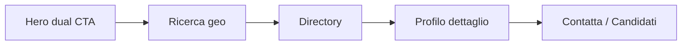

# 09 — Design system e UX

## Filosofia — Care & Trust

Palette e tipografia progettate per un pubblico **socio-sanitario** con utenti anziani e famiglie:

- **Fiducia** — blu indaco primary
- **Calore umano** — coral accent per CTA
- **Verificato / successo** — sage green

Commento sorgente: `design-system/tokens.css` linee 1–4.

---

## Design tokens

### Colori semantici

| Token CSS | Hex | Uso |
|-----------|-----|-----|
| `--color-primary` | `#2A5C82` | Link, primary buttons, brand trust |
| `--color-primary-hover` | `#1E4A6A` | Hover primary |
| `--color-primary-soft` | `#C8DEF0` | Chart bars, backgrounds |
| `--color-primary-softer` | `#EBF4FB` | Icon circles, badges bg |
| `--color-accent` | `#E07A5F` | CTA calde, upgrade Premium |
| `--color-accent-hover` | `#C96347` | Hover accent |
| `--color-sage` | `#81B29A` | Verificato, success, approve |
| `--color-page` | `#F4F1EE` | Background pagina |
| `--color-surface` | `#FDFCFB` | Card surface |
| `--color-text` | `#2D2A27` | Body text |
| `--color-text-muted` | `#7A7268` | Secondary text |
| `--color-border` | `#E5DDD5` | Dividers |

Alias legacy homepage: `--color-warm-accent`, `--color-success`, `--color-accent-purple`.

**Export TS:** `design-system/tokens.ts` — usare per logic JS (chart colors).

### Tipografia

| Token | Valore | Uso |
|-------|--------|-----|
| `--font-heading` | Outfit | Titoli, dashboard section titles |
| `--font-body` | Inter | Body, form, tabelle |
| `--text-display` | clamp(2.1rem, 4.5vw, 2.9rem) | Hero H1 |
| `--text-body` | 1.0625rem (17px) | **Accessibilità anziani** |
| `--text-small` | 0.9375rem (15px) | Meta, table secondary |
| `--text-xs` | 0.8125rem (13px) | Caption, chart labels |

**Google Fonts:** caricati solo con consenso cookie `functional` (`loadGoogleFonts.ts`).

### Spaziatura (base 4px)

`--space-1` (4px) → `--space-8` (64px)

### Radius

| Token | px |
|-------|-----|
| `--radius-sm` | 10 |
| `--radius-md` | 16 |
| `--radius-lg` / `--radius-card` | 24 |
| `--radius-pill` | 9999 |

### Ombre

Tinted indigo, mai nero puro: `--shadow-sm` … `--shadow-lg`, `--shadow-card`

### Layout

| Token | Valore |
|-------|--------|
| `--content-max` | 1140px |
| `--header-h` | 72px |
| `--scroll-padding-top` | header + space-5 |

### Motion

`--motion-ease: cubic-bezier(0.22, 1, 0.36, 1)` — easing naturale

Rispettare `prefers-reduced-motion` via hook `usePrefersReducedMotion`.

---

## Breakpoints (impliciti)

Il progetto usa **CSS responsive** senza breakpoint centralizzati in tokens. Pattern osservati:

| Breakpoint | Comportamento |
|------------|---------------|
| `< 768px` | Mobile: sidebar dashboard off-canvas, tab bar bottom 5 item |
| `768px – 1024px` | Tablet: griglie 2 col |
| `> 1024px` | Desktop: sidebar fissa 260px, content fluid max content-max |

**Dashboard mobile:** `dash-sidebar--open` overlay, max 5 tab in bottom nav (`navItems.slice(0, 5)`).

**Homepage:** `clamp()` su typography e `--home-bridge` per sezioni wave.

---

## Pattern UX

### Sito pubblico

1. **Hero dual-mode** — toggle cerca vs offri assistenza (`HeroAssistenzaBlock`)
2. **Sticky search** — barra ricerca persistente on scroll
3. **Social proof** — carousel profili, FAQ stats, rating stars
4. **Wave dividers** — transizioni morbide tra sezioni colorate

### Dashboard

1. **Welcome banner** — saluto personalizzato + piano account
2. **KPI stat cards** — icona colorata + numero grande
3. **Table + badge status** — color coding semantico (`dash-badge--active`, `--paused`, `--failed`)
4. **Candidate rows** — avatar initials, azioni a destra
5. **Empty states** — illustrazione SVG + CTA secondaria
6. **Toast feedback** — save profilo 3s auto-dismiss

### Wizard registrazione

1. Progress bar step N/total
2. Un focus per step — mobile first
3. Draft auto-save localStorage
4. Consent step GDPR dedicato

### Form validation UX

- Label sempre visibili (`dash-form-label`)
- Counter caratteri bio 500 (`dash-form-label__counter`)
- Range slider tariffe con valore live
- Day pills toggle multi-select

---

## Status badge semantics

| Classe | Significato |
|--------|-------------|
| `dash-badge--active` | Attivo / disponibile |
| `dash-badge--paused` | In pausa |
| `dash-badge--closed` | Chiuso |
| `dash-badge--new` | Nuovo / non letto |
| `dash-badge--failed` | Pagamento fallito |
| `dash-badge--free` | Piano free |
| `dash-badge--verify` | Da verificare |
| `dash-badge--pulse` | Animazione attenzione (richiesta nuova) |

---

## Accessibilità

### Implementato

- `aria-label` su nav dashboard, chart SVG
- `aria-hidden` su icone decorative
- Escape chiude menu mobile header
- Body scroll lock mobile menu
- Font size body 17px
- Focus visibile su form controls (browser default + custom radius)
- Checkbox/toggle con label cliccabili

### Gap da colmare

| Item | Priorità |
|------|----------|
| Skip link "vai al contenuto" | P1 |
| Focus trap modali (UpgradeModal) | P1 |
| Contrast audit WCAG AA su `--color-text-muted` | P1 |
| `aria-live` su toast notifiche | P2 |
| Test screen reader wizard steps | P2 |

---

## Brand e voice

| Contesto | Tono | Esempio |
|----------|------|---------|
| Homepage | Empatico, rassicurante | "Trova assistenza qualificata vicino a te" |
| Dashboard PRO | Motivazionale | "Completa il profilo per più visibilità" |
| Admin | Operativo, conciso | "3 profili in attesa di verifica" |
| Legal | Formale | Termini di servizio |

**Inconsistenza brand:** vedere [01-VISIONE-PRODOTTO.md](01-VISIONE-PRODOTTO.md) — AssistenzaFacile vs Federico Andreoli.

---

## File CSS principali

| File | Scope |
|------|-------|
| `design-system/tokens.css` | Variables globali |
| `index.css` | Reset, import tokens, utility |
| `App.css` | Dashboard completa (~2000+ LOC) |
| `pages/profile-detail.css` | Dettaglio profilo |
| `pages/open-position-detail.css` | Dettaglio posizione |
| `pages/auth/auth-pages.css` | Login |
| `pages/auth/wizard/register-wizard.css` | Wizard |
| `pages/legal/legal-pages.css` | Legal |
| `components/cookie-consent.css` | GDPR banner |

---

## Stitch / Figma sync

Guida export: `federicoandreoli-api/docs/DESIGN-STITCH.md`

Quando si aggiornano colori da Stitch → aggiornare **sia** `tokens.css` **sia** `tokens.ts`.

---

## Riferimenti

- Componenti: [06-COMPONENTI-CONDIVISI.md](06-COMPONENTI-CONDIVISI.md)
- Architettura: [02-ARCHITETTURA-FRONTEND.md](02-ARCHITETTURA-FRONTEND.md)
